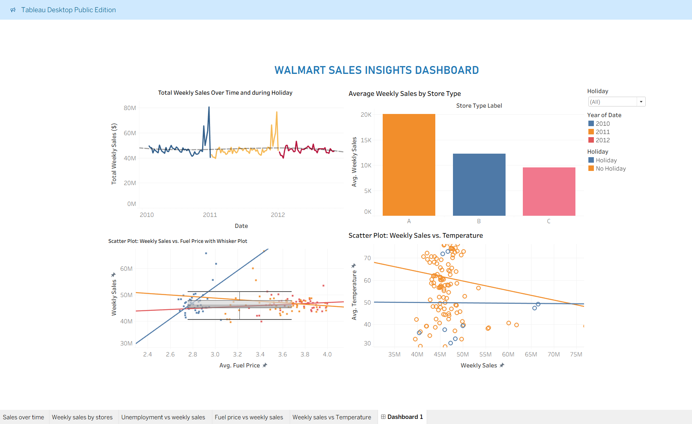

# 🛒 Walmart Weekly Sales Analysis

## Project Overview
This project analyzes **Walmart store-level weekly sales data (2010–2012)** using Python for data processing and feature engineering, and Tableau for interactive visualizations. The goal was to uncover key drivers of weekly sales and build a predictive model to forecast future sales.

---

## Tools Used
- **Python (Pandas, XGBoost, Random Forest)** — Data cleaning, feature engineering, predictive modeling
- **Tableau** — Interactive dashboard and visualizations
- **Jupyter Notebook** — End-to-end analysis workflow
- **GitHub** — Version control and project hosting

---

## Dataset
- **Source:** Walmart Recruiting Store Sales Forecasting — Kaggle
- **Rows:** 421,570 weekly sales records
- **Stores:** 45 stores across multiple departments
- **Date Range:** January 2010 – December 2012
- **Files:** train.csv, features.csv, stores.csv, test.csv

---

## Dashboard Preview

---

## Visualizations

**Weekly Sales Over Time**

> Weekly sales ranged between **$40M–$50M** regularly. Holiday spikes pushed sales to **$80M+** during Christmas and Thanksgiving periods in 2011 and 2012.

---

**Average Weekly Sales by Store Type**

> - **Type A stores:** ~$20K average weekly sales — highest performer
> - **Type B stores:** ~$12K average weekly sales
> - **Type C stores:** ~$9.5K average weekly sales
> - Larger stores consistently outperform smaller ones by up to **2x**

---

**Weekly Sales vs Unemployment Rate**

> Unemployment rate ranged between **8.42–8.52%** across stores. Higher unemployment showed a slight negative correlation with weekly sales, with holiday weeks maintaining sales at **~$50M** regardless of unemployment levels.

---

**Python — Feature Engineering & Predictive Modeling**

> XGBoost model trained on lag features, calendar variables, and markdown flags. Predictions generated for all store-department combinations and exported to `walmart_sales_predictions.csv`.

---

## Modeling Approach

| Model | R² Score | Notes |
|---|---|---|
| Baseline Random Forest | 0.10 | No feature engineering |
| XGBoost with Feature Engineering | 0.95 | Lag sales + calendar features added |

> Feature engineering improved model accuracy by **85 percentage points** — from explaining 10% to 95% of sales variance.

---

## Key Stats & Outcomes

| Metric | Value |
|---|---|
| Total Records Analyzed | 421,570 rows |
| Stores Analyzed | 45 stores |
| Departments Covered | Multiple per store |
| Date Range | Jan 2010 – Dec 2012 |
| Peak Weekly Sales | $80M+ (Holiday periods) |
| Average Weekly Sales | $40M – $50M |
| Type A Store Avg Sales | ~$20K per week |
| Type B Store Avg Sales | ~$12K per week |
| Type C Store Avg Sales | ~$9.5K per week |
| Baseline Model R² | 0.10 |
| Final Model R² | 0.95 |
| Model RMSE | 5,300 |
| Missing Data Handled | Markdowns, CPI, Unemployment |

---

## Key Insights

- 🏪 **Store size** is the primary driver — Type A stores outsell Type C by over 2x
- 🎄 **Holiday seasons** spike sales to $80M+ — Christmas and Thanksgiving have the biggest impact
- 💸 **Markdowns** boost sales short-term but effects vary significantly across departments
- 📉 **Fuel prices** show slight negative correlation with weekly sales
- 🌡️ **Temperature** inversely affects sales — higher temperatures lead to lower store visits
- 📊 **Lag features** were the single biggest factor in improving model R² from 0.10 to 0.95

---

## Business Recommendations

- Invest in larger store formats (Type A) for maximum sales volume
- Use targeted markdowns aggressively during holiday periods for maximum ROI
- Monitor CPI and unemployment trends for inventory and promotion planning
- Build lag-based forecasting into weekly planning cycles

---

## Author
**Ishan Karandikar**
MBA Business Analytics — University Canada West, Vancouver BC
